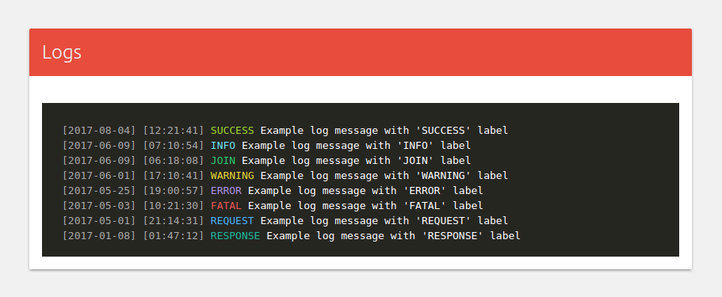
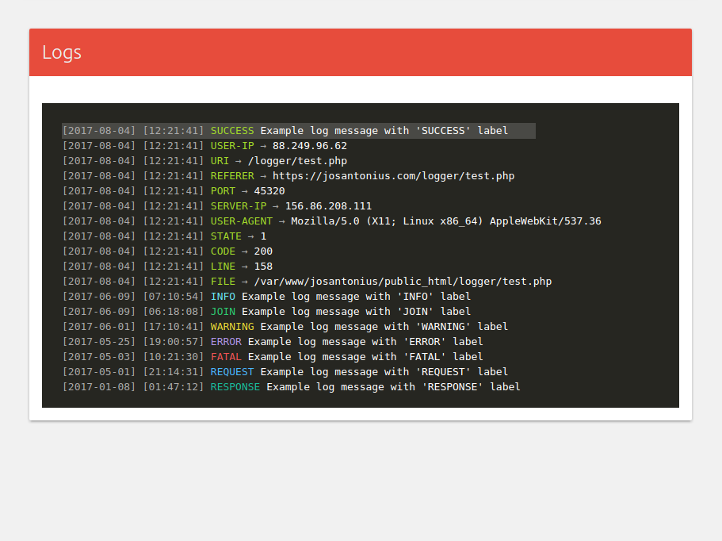
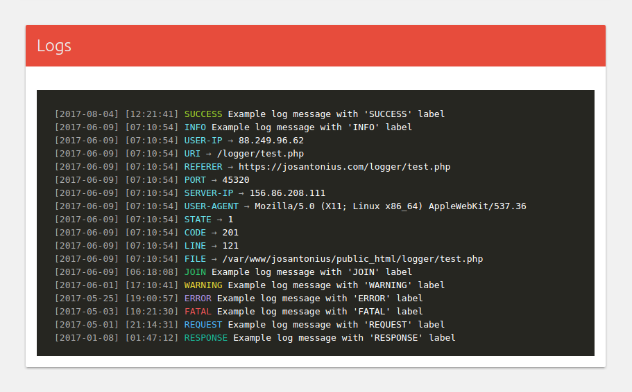
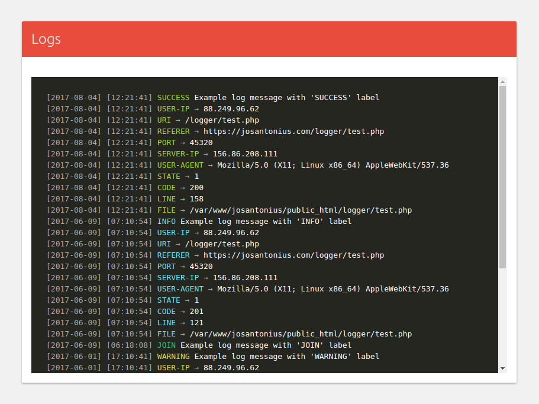
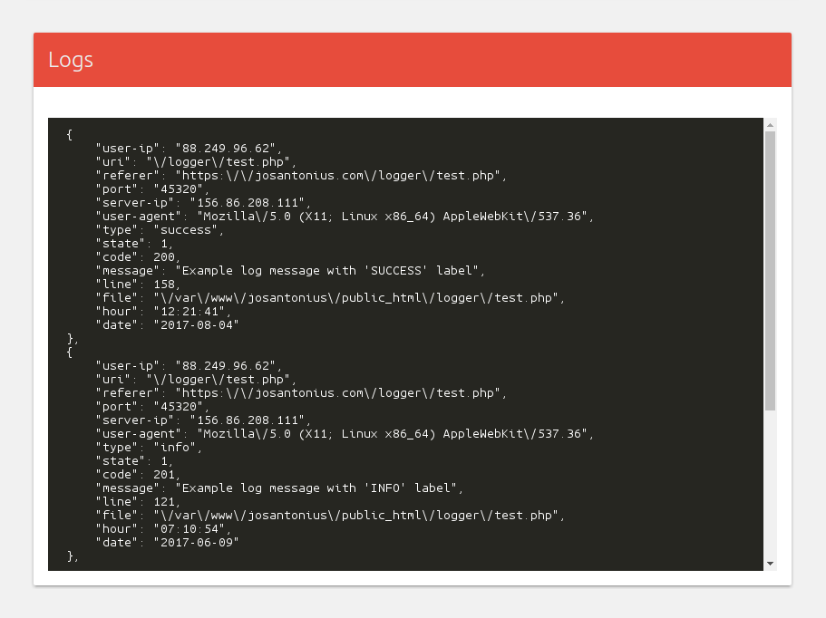

# PHP Logger library

[](https://packagist.org/packages/josantonius/Logger) [](https://packagist.org/packages/josantonius/Logger) [](LICENSE) [](https://www.codacy.com/app/Josantonius/PHP-Logger?utm_source=github.com&amp;utm_medium=referral&amp;utm_content=Josantonius/PHP-Logger&amp;utm_campaign=Badge_Grade) [](https://packagist.org/packages/josantonius/Logger) [](https://travis-ci.org/Josantonius/PHP-Logger) [](http://www.php-fig.org/psr/psr-2/) [](http://www.php-fig.org/psr/psr-4/) [](https://codecov.io/gh/Josantonius/PHP-Logger)

[Spanish version](README-ES.md)

Biblioteca php para crear logs fácilmente y almacenarlos en formato Json.

---

- [Requisitos](#requisitos)
- [Instalación](#instalación)
- [Métodos disponibles](#métodos-disponibles)
- [Cómo empezar](#cómo-empezar)
- [Métodos disponibles](#métodos-disponibles)
- [Uso](#uso)
- [Tests](#tests)
- [Tareas pendientes](#-tareas-pendientes)
- [Contribuir](#contribuir)
- [Repositorio](#repositorio)
- [Licencia](#licencia)
- [Copyright](#copyright)

---

## Requisitos

Esta clase es soportada por versiones de **PHP 5.6** o superiores y es compatible con versiones de **HHVM 3.0** o superiores.

## Instalación 

La mejor forma de instalar esta extensión es a través de [Composer](http://getcomposer.org/download/).

Para instalar **PHP Logger library**, simplemente escribe:

    $ composer require Josantonius/Logger

El comando anterior sólo instalará los archivos necesarios, si prefieres **descargar todo el código fuente** puedes utilizar:

    $ composer require Josantonius/Logger --prefer-source

También puedes **clonar el repositorio** completo con Git:

  $ git clone https://github.com/Josantonius/PHP-Logger.git

O **instalarlo manualmente**:

[Descargar Logger.php](https://raw.githubusercontent.com/Josantonius/PHP-Logger/master/src/Logger.php):

    $ wget https://raw.githubusercontent.com/Josantonius/PHP-Logger/master/src/Logger.php

[Descargar Json.php](https://raw.githubusercontent.com/Josantonius/PHP-Json/master/src/Json.php):

    $ wget https://raw.githubusercontent.com/Josantonius/PHP-Json/master/src/Json.php

## Imágenes







## Métodos disponibles

Métodos disponibles en esta biblioteca:

### - Iniciar manejo de logs en el  sitio:

```php
new Logger($path, $filename, $logNumber, $ip, $states);
```

Atributo | Descripción | Tipo | Requerido | Predeterminado
| --- | --- | --- | --- | --- |
| $path | Ruta donde guardar los logs. | string | No | null |
| $filename | Nombre de archivo JSON que guardará los registros. | string | No | null |
| $logNumber | Número máximo de logs guardar en el archivo. | int | No | 200 |
| $ip | IP del usuario. | string | No | null |
| $states | Diferentes estados para los logs. | array | No | null |

**# Return** (void)

### - Guardar log:

```php
Logger::save($type, $code, $msg, $line, $file, $data);
```

Atributo | Descripción | Tipo | Requerido | Predeterminado
| --- | --- | --- | --- | --- |
| $type | Tipo de error o aviso. | string | Yes | |
| $code | Código de estado de respuesta HTTP. | int | Yes | |
| $message | Mensaje. | string | Yes | |
| $line | Línea desde la que se guarda el log. | int | Yes | |
| $file | Ruta del archivo desde el que se llama el método. | string | Yes | |
| $data | Parámetros extra personalizados. | array | No | 0 |

**# Return** (boolean)

### - Guarda los registros en archivo JSON:

```php
Logger::store();
```

**# Return** (boolean)

### - Obtener logs guardados:

```php
Logger::get();
```

**# Return** (array) → logs guardados

### - Definir directorio para scripts y obtener url del archivo:

```php
Logger::script($url);
```

Atributo | Descripción | Tipo | Requerido | Predeterminado
| --- | --- | --- | --- | --- |
| $url | Url del archivo. | string | Yes | |

**# Return** (string) → url del archivo

### - Definir directorio para estilos y obtener url del archivo:

```php
Logger::style($url);
```

Atributo | Descripción | Tipo | Requerido | Predeterminado
| --- | --- | --- | --- | --- |
| $url | Url del archivo. | string | Yes | |

**# Return** (string) → url del archivo

### - Obtener el número de logs guardados en la sección actual:

```php
::added();
```

**# Return** (int) → logs añadidos en la sección actual

### - Mostrar sección de registros**

```php
Logger::render();
```

**# Return** (boolean true)

### - Restablecer parámetros:

```php
Logger::reset();
```

**# Return** (boolean true)

## Cómo empezar

Para utilizar esta biblioteca con **Composer**:

```php
require __DIR__ . '/vendor/autoload.php';

use Josantonius\Logger\Logger;
```

Si la instalaste **manualmente**, utiliza:

```php
require_once __DIR__ . '/Logger.php';
require_once __DIR__ . '/Json.php';

use Josantonius\Logger\Logger;
```

## Uso

Ejemplo de uso para esta biblioteca:

### - Ejemplo básico

```php
<?php
require __DIR__ . '/vendor/autoload.php';

use Josantonius\Logger\Logger;

new Logger();

Logger::save('SUCCESS',  100, 'msg', __LINE__, __FILE__);
Logger::save('JOIN',     200, 'msg', __LINE__, __FILE__);
Logger::save('INFO',     300, 'msg', __LINE__, __FILE__);
Logger::save('WARNING',  400, 'msg', __LINE__, __FILE__);
Logger::save('ERROR',    500, 'msg', __LINE__, __FILE__);
Logger::save('FATAL',    600, 'msg', __LINE__, __FILE__);
Logger::save('REQUEST',  700, 'msg', __LINE__, __FILE__);
Logger::save('RESPONSE', 800, 'msg', __LINE__, __FILE__);

Logger::storeLogs();
```

### - Ejemplo avanzado

```php
<?php
require __DIR__ . '/vendor/autoload.php';

use Josantonius\Logger\Logger;

$states  = [

  'global'    => true,
  'exception' => true,
  'error'     => false,
  'notice'    => false,
  'fatal'     => true,
];

new Logger('/logger/', 'logs', 600, '58.80.84.44', $states);

Logger::save('EXCEPTION', 400, 'msg', __LINE__, __FILE__);
Logger::save('ERROR' ,    402, 'msg', __LINE__, __FILE__);
Logger::save('NOTICE',    100, 'msg', __LINE__, __FILE__);

$params = [

  'id-user'   => 68,
  'name-user' => 'Joe'
]; 
        
Logger::save('FATAL, 500, 'msg', __LINE__, __FILE__, $params);

Logger::storeLogs();

echo 'Logs added: ' . Logger::added();

echo 'Logs added: ' . count(Logger::get);

printf('<link href="%s">', Logger::style('http://site.com/public/css/'));

printf('<script src="%s">', Logger::script('http://site.com/public/js/'));

Logger::render();
```

## Tests 

Para ejecutar las [pruebas](tests) necesitarás [Composer](http://getcomposer.org/download/) y seguir los siguientes pasos:

    $ git clone https://github.com/Josantonius/PHP-Logger.git
    
    $ cd PHP-Logger

    $ composer install

Ejecutar pruebas unitarias con [PHPUnit](https://phpunit.de/):

    $ composer phpunit

Ejecutar pruebas de estándares de código [PSR2](http://www.php-fig.org/psr/psr-2/) con [PHPCS](https://github.com/squizlabs/PHP_CodeSniffer):

    $ composer phpcs

Ejecutar pruebas con [PHP Mess Detector](https://phpmd.org/) para detectar inconsistencias en el estilo de codificación:

    $ composer phpmd

Ejecutar todas las pruebas anteriores:

    $ composer tests

## ☑ Tareas pendientes

- [ ] Añadir nueva funcionalidad.
- [ ] Mejorar pruebas.
- [ ] Mejorar documentación.
- [ ] Refactorizar código para las reglas de estilo de código deshabilitadas. Ver [phpmd.xml](phpmd.xml) y [.php_cs.dist](.php_cs.dist).

## Contribuir

Si deseas colaborar, puedes echar un vistazo a la lista de
[issues](https://github.com/Josantonius/PHP-Logger/issues) o [tareas pendientes](#-tareas-pendientes).

**Pull requests**

* [Fork and clone](https://help.github.com/articles/fork-a-repo).
* Ejecuta el comando `composer install` para instalar dependencias.
  Esto también instalará las [dependencias de desarrollo](https://getcomposer.org/doc/03-cli.md#install).
* Ejecuta el comando `composer fix` para estandarizar el código.
* Ejecuta las [pruebas](#tests).
* Crea una nueva rama (**branch**), **commit**, **push** y envíame un
  [pull request](https://help.github.com/articles/using-pull-requests).

## Repositorio

La estructura de archivos de este repositorio se creó con [PHP-Skeleton](https://github.com/Josantonius/PHP-Skeleton).

## Licencia

Este proyecto está licenciado bajo **licencia MIT**. Consulta el archivo [LICENSE](LICENSE) para más información.

## Copyright

2017 - 2018 Josantonius, [josantonius.com](https://josantonius.com/)

Si te ha resultado útil, házmelo saber :wink:

Puedes contactarme en [Twitter](https://twitter.com/Josantonius) o a través de mi [correo electrónico](mailto:hello@josantonius.com).